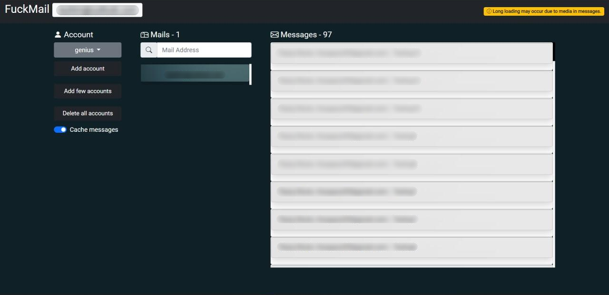
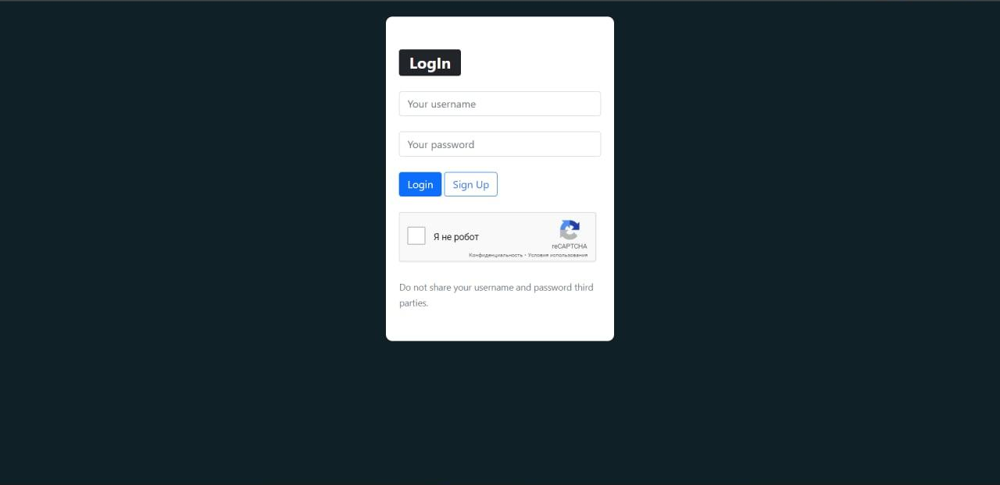

# FuckMail Instruction

## Add config variables
Create `config.yaml` in FuckMail_App:

```yaml
SECRET_KEY: <your value>
DEBUG: <your value>
GOOGLE_RECAPTCHA_PUBLIC_KEY: <your value>
GOOGLE_RECAPTCHA_SECRET_KEY: <your value>
DB:
  NAME: <your value>
  USER: <your value>
  PASSWORD: <your value>
  HOST: <your value>
  PORT: <your value>
```

## Run:

```js
python3 manage.py migrate
python3 manage.py runserver
```

## Images
#### Main page

====
#### Auth page
